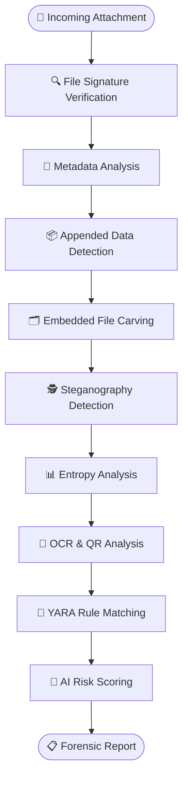

#       AI-Powered-Hiddeen-Attachment-Threat-Analyzer

# 🛡️ Operation HATA
### Hidden Attachment Threat Analyzer

---

### 🔍 Intelligent Detection of Hidden Threats Embedded Inside Email Image Attachments

---

# 📖 Overview

**Operation HATA (Hidden Attachment Threat Analyzer)** is an AI-powered digital forensic framework that automatically inspects incoming email image attachments before they reach the user.

Unlike traditional antivirus solutions that mainly rely on malware signatures, HATA combines multiple forensic analysis techniques to uncover hidden threats such as:

- 🕵 Hidden Payloads
- 🖼 Steganography
- 📂 Embedded Files
- 📑 Malicious Metadata
- 📊 High Entropy Regions
- 🔳 QR Code Phishing
- 🦠 Known Malware Signatures
- 🤖 AI-Based Threat Prediction

Finally, the system generates a comprehensive forensic report with an overall risk score.

---

# 🚀 Workflow

---

# ✨ Detection Pipeline

| Module | Purpose |
|---------|----------|
| 🔍 File Signature Verification | Verify actual file type and detect spoofing |
| 📄 Metadata Analysis | Extract EXIF/IPTC metadata and identify anomalies |
| 📦 Appended Data Detection | Detect hidden data appended after image end markers |
| 🗂 Embedded File Carving | Recover embedded ZIPs, executables, PDFs, or archives |
| 🕵 Steganography Detection | Detect hidden information inside image pixels |
| 📊 Entropy Analysis | Locate encrypted or compressed suspicious regions |
| 🔳 OCR & QR Analysis | Extract hidden text and decode malicious QR codes |
| 🦠 YARA Rule Matching | Detect known malware patterns |
| 🤖 AI Risk Scoring | Predict overall threat probability |

---

# 📋 Forensic Report

After completing all analysis stages, HATA generates a report containing:

- File Information
- File Signature Status
- Metadata Summary
- Hidden Payload Detection
- Embedded File Details
- Steganography Findings
- Entropy Score
- OCR Results
- QR Code Results
- YARA Matches
- AI Risk Score
- Final Recommendation

---

# 🎯 Objectives

- Detect hidden threats before users open image attachments.
- Reduce manual forensic investigation.
- Combine multiple forensic tools into one pipeline.
- Provide AI-assisted threat prediction.
- Improve email attachment security.

---

# 💡 Why Project HATA?

Traditional security tools usually perform only one or two checks.

Operation HATA integrates multiple forensic techniques into one intelligent framework.

✔ Signature Verification

✔ Metadata Analysis

✔ Payload Detection

✔ File Carving

✔ Steganography Detection

✔ Entropy Analysis

✔ OCR

✔ QR Detection

✔ YARA Matching

✔ AI Risk Prediction

---

# 🛠️ Tech Stack

- Python
- OpenCV
- Pillow
- ExifTool
- Binwalk
- Foremost
- StegExpose
- zsteg
- Tesseract OCR
- pyzbar
- YARA
- Scikit-Learn
- FastAPI
- MongoDB

---

# 📌 Future Enhancements

- 📄 PDF Analysis
- 📁 Office Document Analysis
- 📦 ZIP/RAR Inspection
- 🎥 Video Steganography
- 🎵 Audio Steganography
- ☁ Cloud Deployment
- 📧 Outlook/Gmail Plugin
- 📊 SOC Dashboard
- 🔥 Real-Time Email Monitoring

---

# 🛡️ Operation HATA

### Hidden Attachment Threat Analyzer

### Detect • Analyze • Protect

⭐ Star this repository if you like the project.

